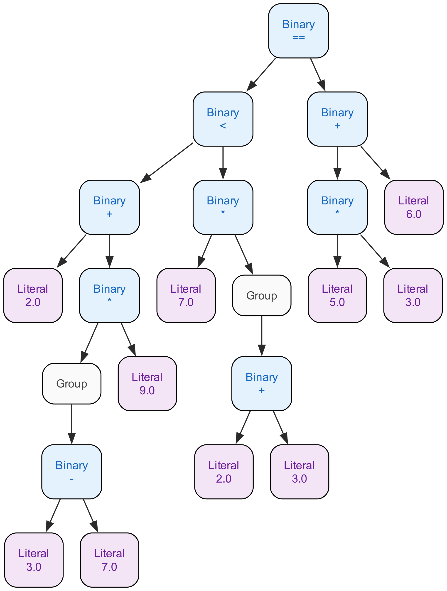

# [Lox](https://craftinginterpreters.com/the-lox-language.html) Interpreter in Go

## Online Playground

Try it at [golox.tushartripathi.me](https://golox.tushartripathi.me/).


<details>
<summary>Mobile version</summary>

</details>
<br/>


- [Tinygo](https://tinygo.org/) is used to compile the interpreter code to WASM.
- The web playground is written with Bun and Preact, which interprets the LOX code using the above generated WASM, locally in the browser. The related code is in the `playground` directory.

## Running the program

### Interpret a lox file

This is the main command, which runs your program. You can try it out in the [playground](https://golox.tushartripathi.me/).

```sh
./run.sh run <filename>
```

### Tokenize

Prints the tokens in the source code.

```sh
./run.sh tokenize <filename>
```

### Parse

Parses the tokens array and prints the AST. The AST is printed as a list of [S-expressions](https://en.wikipedia.org/wiki/S-expression). There is also a visualize command to see a visual representation of the AST.

```sh
./run.sh parse <filename>
```

### Visualise

Visthis command creates a DOT file and then generates a PNG image with Graphviz which shows the AST as a tree.

```sh
./run.sh visualize <filename>
```

Example:

AST for this expression - `2+(3-7)*9 < 7 * (2 + 3) == 5 * 3 + 6`




## Running tests

```sh
python test.py <suite_name>
```

example

```sh
> python test.py golox
> python test.py chap10_functions
```

`golox` runs all tests. Optionally you can filter tests upto a specific chapter.

## Grammar for the lox language

### How to read

- Each rule is in the form `<rule_name> -> symbols`.
- There are two types of symbols:
  - Terminal symbols are the characters that make up the language. They're tokens from the language grammar. They're either in double quotes or caps if they're referring to a literal(`STRING`, `NUMBER`, `IDENTIFIER`).
  - Non-terminal symbols recursively refer to other rules. It leads to composition of the rules to make the grammar.
- There are some postfix and binary operators based on regex to simplify writing the grammar -
  - `+` means one or more of the preceding symbol
  - `*` means zero or more of the preceding symbol
  - `?` means zero or one of the preceding symbol
  - `|` means one of the symbols on either side
  - `(` and `)` are used to group symbols
- The lines are in order of precedence. Each rule only matches expressions at
  its precedence level or higher.

```ebnf
(* program is basically a list of statements *)
program        → declaration* EOF ;

(* declare variables, classes and functions *)
declaration    → classDecl
               | varDecl
               | funDecl
               | statement ;

classDecl      → "class" IDENTIFIER ( "<" IDENTIFIER )? "{" function* "}" ;
varDecl        → "var" IDENTIFIER ( "=" expression )? ";" ;
funDecl        → "fun" function ;
function       → IDENTIFIER "(" parameters? ")" blockStmt ;
parameters     → IDENTIFIER ( "," IDENTIFIER )* ;


statement      → exprStmt
               | printStmt
               | ifStmt
               | whileStmt
               | forStmt
               | returnStmt
               | blockStmt ;

exprStmt       → expression ";" ;
printStmt      → "print" expression ";" ;
ifStmt         → "if" "(" expression ")" statement
               ( "else" statement )? ;
whileStmt      → "while" "(" expression ")" statement ;
forStmt        → "for" "(" (varDecl | exprStmt | ";")
               expression? ";" 
               expression? ")" statement ;
blockStmt      → "{" declaration* "}" ;
returnStmt     → "return" expression? ";" ;

(* define expressions in order of precedence *)
expression     → assignment ;
(* a = 2 or breakfast.milk.sugar = 4 *)
assignment     → ( call "." )? IDENTIFIER "=" assignment
               | logic_or ;
logic_or       → logic_and ( "or" logic_and )* ;
logic_and      → equality ( "and" equality )* ;
equality       → comparison ( ( "!=" | "==" ) comparison )* ;
comparison     → term ( ( ">" | ">=" | "<" | "<=" ) term )* ;
term           → factor ( ( "-" | "+" ) factor )* ;
factor         → unary ( ( "/" | "*" ) unary )* ;
unary          → ( "!" | "-" ) unary
               | call ;
(* If there are no parentheses, this parses a bare primary expression. *)
(* Otherwise, there can be multiple layers of calls, like abc()() *)
(* and field access or both, like myClass.pqr().abc()() *)
call           → primary ( "(" arguments? ")" | "." IDENTIFIER )* ;
primary        → NUMBER | STRING | "true" | "false" | "nil"
               | "(" expression ")"
               | IDENTIFIER 
               | this | "super" "." IDENTIFIER ;

(* helper rules *)
arguments      → expression ( "," expression )* ;
```


